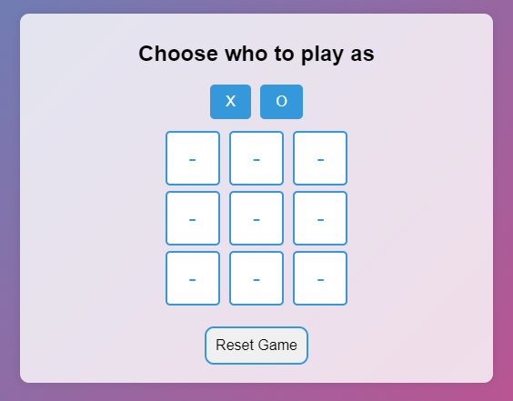

# Tic Tac Toe Game 🎮

Welcome to the Tic Tac Toe Game project! This is a simple implementation of the classic Tic Tac Toe game that you can play in your browser.

## About the Project ℹ️

This project is a web-based implementation of the popular Tic Tac Toe game with a user-friendly interface.

## Demo




## Features 🚀

- Play the classic Tic Tac Toe game against a friend
- Clear and intuitive user interface
- Responsive design for seamless gameplay across devices

## Getting Started 🚦

To get a local copy up and running, follow these simple steps:

1. Clone the repository
   ```sh
   git clone https://github.com/patrikinho0/Tic-Tac-Toe.git
2. Launch the project on your device 🚀

<br><br>
<p align="center">Made by <a href="https://github.com/patrikinho0">patrikinho</a></p>
